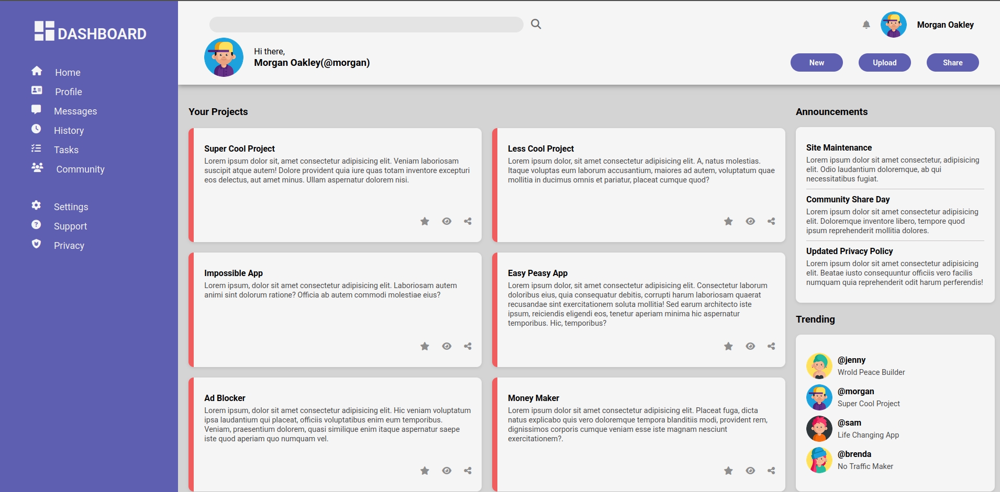

# Dashboard

A user-friendly dashboard designed as part of **The Odin Project** curriculum. This project features a responsive layout with a sidebar navigation, a header section, and a main content area displaying user projects and announcements.

## Features

- **Responsive Design** — Adapts to various screen sizes for optimal viewing.
- **Sidebar Navigation** — Easy access to different sections of the dashboard.
- **User Profile Section** — Displays user information and avatar.
- **Project Cards** — Showcases user projects with descriptions and actions.
- **Announcements and Trending Sections** — Keeps users updated with the latest information.

## Screenshot



## Live Demo

View the live site: [Live Dashboard](https://lozfunk.github.io/dashboard/)

## Technologies Used

- HTML5
- CSS3 (Flexbox, Grid Layout)

## Project Structure

```
Dashboard/
├── index.html          # Main page structure
├── style.css           # Styling and layout
├── images/             # Image assets
└── README.md           # This file
```

## How to Run Locally

1. Clone the repository:
   ```bash
   git clone <your-repo-url>
   cd "The Odin Project"
   ```

2. Open in a browser or use a local server:
   ```bash
   python3 -m http.server 8000
   # Then navigate to: http://localhost:8000/Dashboard/
   ```

## Assignment Info

This project is from **The Odin Project** — Foundations course, HTML/CSS section.  
[View the assignment →](https://www.theodinproject.com/lessons/node-path-intermediate-html-and-css-dashboard)

## Credits

- Icons from [Font Awesome](https://fontawesome.com/)
- Avatar images sourced from [Unsplash](https://unsplash.com/)
